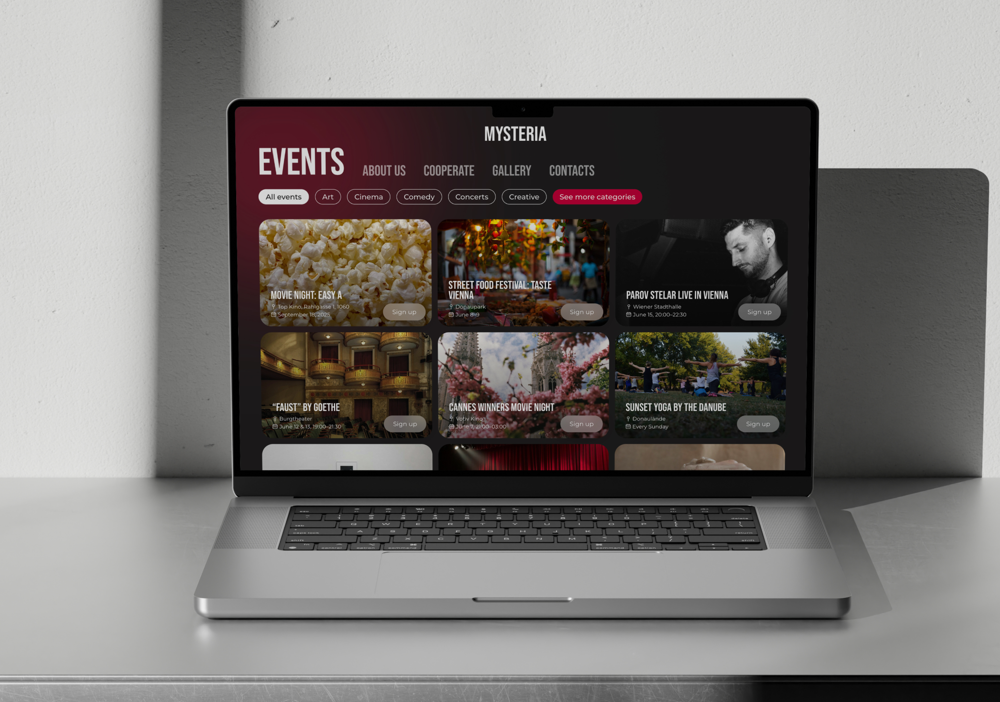
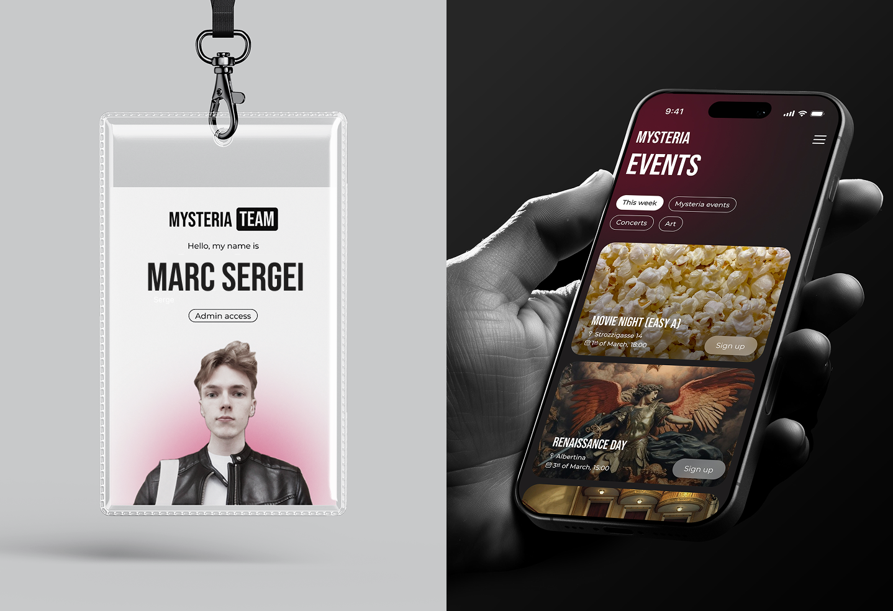
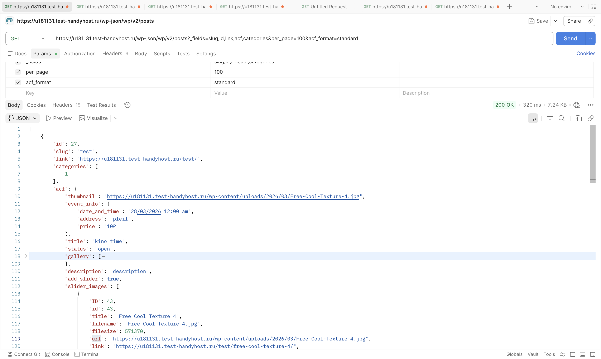
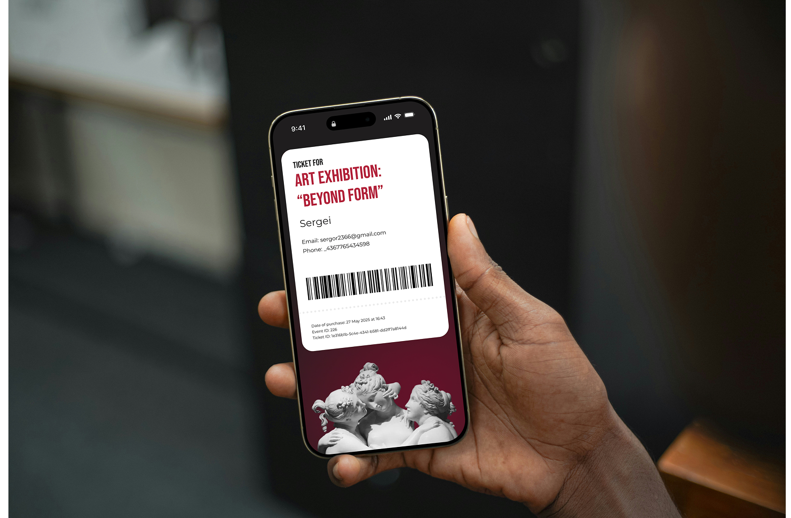
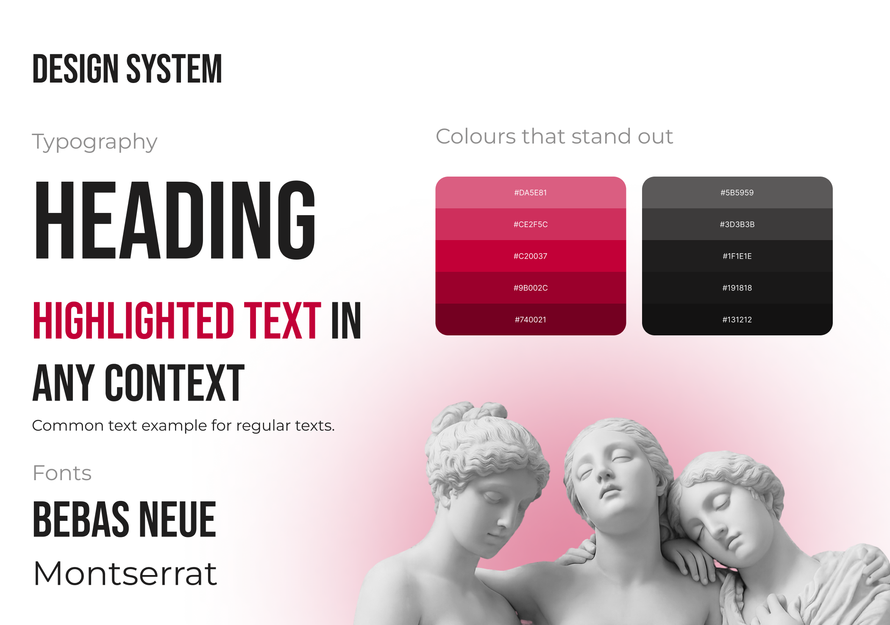

# Mysteria — Event Discovery Platform

A web platform for discovering and registering for cultural and social events in Vienna.

Mysteria was built **from scratch**, starting from the initial product idea and UX design to frontend development, backend integration, API testing, and deployment.

The project demonstrates the development of a **production-style web application** using a **Headless CMS architecture with a modern React framework**.

🌐 **Live Demo:**  
https://mysteria-wos9.vercel.app

---

# Product Development Process

This project was developed following a full **product lifecycle**:
Idea → UX Research → UI Design → Development → API Integration → Testing → Deployment

Steps included:

- defining the product concept
- designing user flows
- creating UI prototypes
- building frontend architecture
- integrating backend APIs
- testing and deploying the application

---

# Tech Stack

## Frontend

- Next.js
- React
- SCSS / Sass
- Swiper.js

## Backend

- Headless WordPress
- REST API

## Tools

- Figma
- Postman
- Vercel

---

# Key Features

The platform allows users to browse and register for events.

Main functionality includes:

- event catalog
- event detail pages
- filtering events by categories
- event registration form
- automatic ticket generation
- QR code generation for tickets
- ticket delivery via email
- QR ticket validation
- event timeline section
- image galleries and sliders
- fully responsive design

---

# Frontend Architecture

The frontend is built using **Next.js and React**, with a modular component-based architecture.

Main principles:

- reusable UI components
- separation of UI and business logic
- dynamic routing for event pages
- responsive layout
- optimized rendering with Next.js

Example project structure:
/components
/EventCard
/EventForm
/Slider
/Layout

/pages
/events
/events/[id]

/styles
/api
/utils

---

# Backend Architecture

The backend is implemented using **Headless WordPress CMS**.

WordPress acts as a content management system while the frontend communicates with it via **REST API**.

Benefits of this approach:

- independent frontend development
- easy content management through admin panel
- scalable architecture
- flexible API-based data access

Content managed in WordPress:

- events
- event images
- categories
- event metadata

---

# API Integration

The frontend communicates with WordPress using **REST API**.

API functionality includes:

- fetching event data
- filtering events
- submitting registration forms
- generating ticket information

API requests were tested and debugged using **Postman**.

---

# Ticket System

The platform includes a simple **event ticketing system**.

Ticket workflow:

1. User opens an event page
2. User registers through the event form
3. A ticket with a **unique QR code** is generated
4. The ticket is sent to the user's email
5. The QR code can be used for ticket verification

---

# UI / UX Design

The interface of the platform was designed independently.

Design process:

- wireframing
- UI prototyping
- component design
- visual hierarchy planning

Design tools:

- Figma

Background in visual arts helped create a balanced and structured interface.

---

# Performance Optimization

Several optimizations were implemented:

- optimized rendering with Next.js
- caching API requests
- optimized image usage
- structured component architecture
- responsive layouts for different screen sizes

---

# Deployment

The project is deployed using **Vercel**.

Deployment includes:

- production build optimization
- environment configuration
- Next.js hosting

🌐 Live version:  
https://mysteria-wos9.vercel.app

---

# What This Project Demonstrates

This project demonstrates experience with:

- building a fullstack web application
- modern React development with Next.js
- Headless CMS architecture
- REST API integration
- UX/UI design workflow
- implementing real-world user flows
- deploying production-ready applications

---

# Future Improvements

Possible future improvements:

- authentication system
- payment integration
- event search functionality
- admin dashboard for event management
- performance improvements